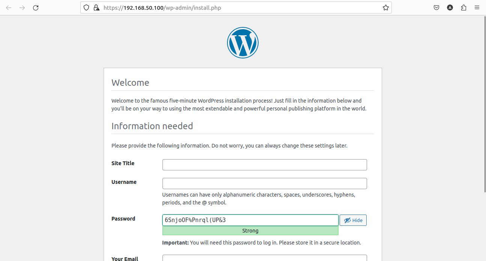
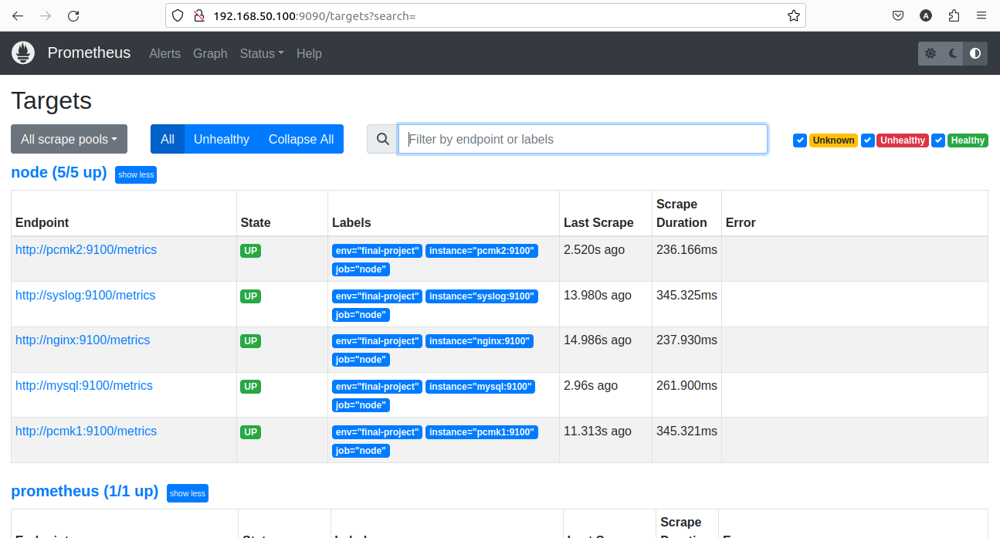
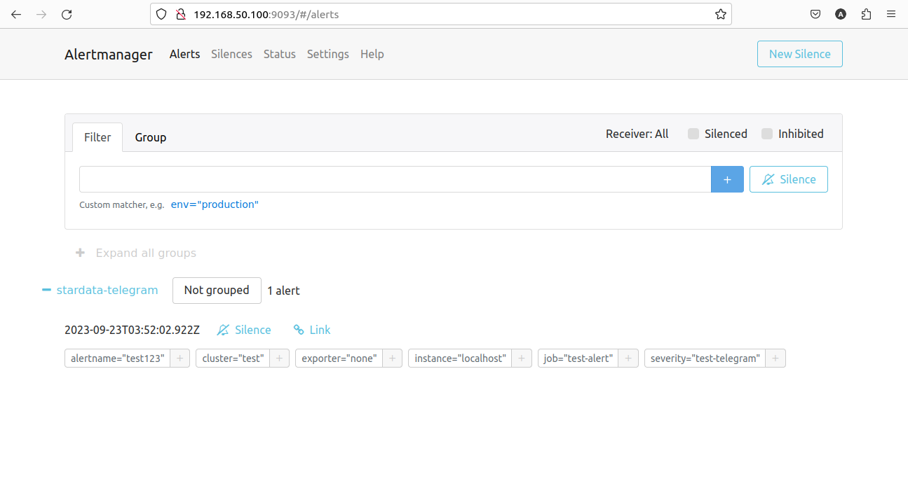
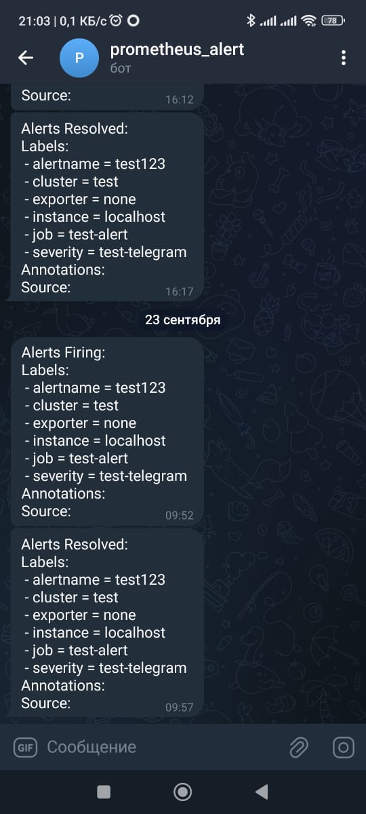
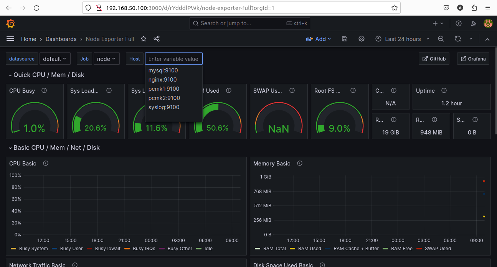
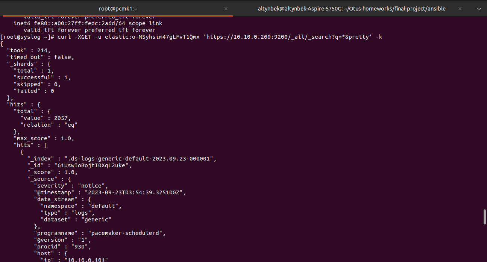
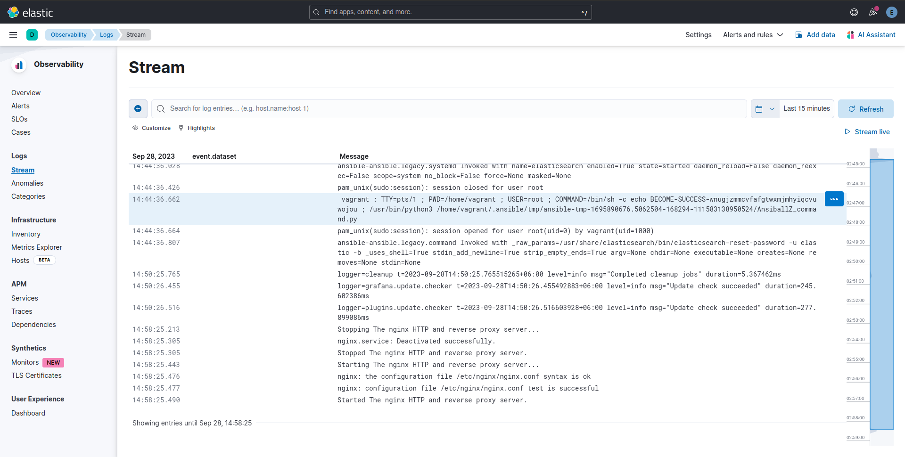

# Проектная работа
Для поднятия данной проектной работы в виде небольшой инфраструктуры требуется установить (для Ubuntu 22.04):
1. Установить и настроить сеть на Virtualbox 7.0:
```
wget -O- https://www.virtualbox.org/download/oracle_vbox_2016.asc | sudo gpg --dearmor --yes --output /usr/share/keyrings/oracle-virtualbox-2016.gpg
sudo apt-get update
sudo apt-get install virtualbox-7.0
sudo vi /etc/vbox/networks.conf
* 192.168.50.0/24
```
2. Установить vagrant:
```
wget -O- https://apt.releases.hashicorp.com/gpg | gpg --dearmor | sudo tee /usr/share/keyrings/hashicorp-archive-keyring.gpg
echo "deb [signed-by=/usr/share/keyrings/hashicorp-archive-keyring.gpg] https://apt.releases.hashicorp.com $(lsb_release -cs) main" | sudo tee /etc/apt/sources.list.d/hashicorp.list
sudo apt update && sudo apt install vagrant
```
3. Установить git и openssh-server:
```
sudo apt update && sudo apt install git openssh-server
```
Копируем разворачиваемую проекную работу с моего репозитория git:
```
cd ~
mkdir Otus-homeworks
cd Otus-homeworks
git clone https://github.com/altyn-kenzhebaev/final-project.git
```
4. Прединструкция как был собран fence-agents-vbox-4.12.1-3.el9.noarch.rpm
В репозиториях almalinux 9 нет данного пакета,поэтому данный пакет был собран из исходных кодов пакета fence-agents-4.12.1-3.fc39.src.rpm. Первым делом скачиваем исходники:
```
curl -o fence-agents-4.12.1-3.fc39.src.rpm https://dl.fedoraproject.org/pub/fedora/linux/development/rawhide/Everything/source/tree/Packages/f/fence-agents-4.12.1-3.fc39.src.rpm
```
Включаем дополнительные репозитории almalinux 9 для скачивания пакетов компеляции из исходников:
```
vi /etc/yum.repos.d/almalinux-crb.repo 
[crb]
enabled=1
vi /etc/yum.repos.d/almalinux-highavailability.repo
[highavailability]
enabled=1
```
Скачиваем пакеты для компиляции:
```
yum -y install rpm-build gcc autoconf automake corosynclib-devel libtool libuuid-devel libvirt-devel libxml2-devel libxslt nspr-devel nss-devel openwsman-python3 python3-boto3 python3-devel python3-httplib2 python3-pexpect python3-pycurl python3-suds
```
Распаковываем исходник, и правим 2 файла:
```
rpm2cpio fence-agents-4.12.1-3.fc39.src.rpm | cpio -idvm
tar -xf fence-agents-4.12.1.tar.gz
cd fence-agents-4.12.1
vi fence-agents.spec.in
    %package vbox
    License: GPLv2+ and LGPLv2+
    Summary: Fence agent for VirtualBox
    Requires: openssh-clients
    Requires: fence-agents-common           # need to edit this line
    BuildArch: noarch
    %description vbox
    Fence agent for VirtualBox dom0 accessed via SSH.
    %files vbox
    %{_sbindir}/fence_vbox
    %{_mandir}/man8/fence_vbox.8*
cd /root
vi fence-agents.spec
    %package vbox
    License: GPLv2+ and LGPLv2+
    Summary: Fence agent for VirtualBox
    Requires: openssh-clients
    Requires: fence-agents-common           # need to edit this line
    BuildArch: noarch
    %description vbox
    Fence agent for VirtualBox dom0 accessed via SSH.
    %files vbox
    %{_sbindir}/fence_vbox
    %{_mandir}/man8/fence_vbox.8*
```
Собираем пакет из исходников `rpmbuild -ba --define '_sourcedir /root' fence-agents.spec`. Нужный нам пакет лежит по следующем пути `/root/rpmbuild/RPMS/noarch/fence-agents-vbox-4.12.1-3.el9.noarch.rpm`

5. Подготавливаем наш hosted_machine и генерируем ssh ключи для проекта:
```
ssh-keygen -f /home/altynbek/Otus-homeworks/final-project/ansible/roles/cluster-setup/files/private_key
mkdir ~/.ssh
mv /home/altynbek/Otus-homeworks/final-project/ansible/roles/cluster-setup/files/private_key.pub ~/.ssh/authorized_keys
vi /etc/sudoers.d/local
altynbek     ALL=(ALL)     NOPASSWD: ALL
ssh-keygen -f /home/altynbek/Otus-homeworks/final-project/ansible/roles/backup-client/files/private_key
mkdir /home/altynbek/Otus-homeworks/final-project/ansible/roles/backup-setup/files
mv /home/altynbek/Otus-homeworks/final-project/ansible/roles/backup-client/files/private_key.pub /home/altynbek/Otus-homeworks/final-project/ansible/roles/backup-setup/files/authorized_keys
sed -i '1s/./command\=\"borg serve \-\-restrict\-to\-path \/var\/backup"\,restrict\ &/' /home/altynbek/Otus-homeworks/final-project/ansible/roles/backup-setup/files/authorized_keys
```
6. В целях легкого развертывания ВМ проектной работы предварительно скачиваем весомые пакеты ПО:
```
mkdir /home/altynbek/Otus-homeworks/final-project/ansible/roles/grafana-setup/files/
wget -O /home/altynbek/Otus-homeworks/final-project/ansible/roles/grafana-setup/files/grafana-enterprise-10.1.2-1.x86_64.rpm https://dl.grafana.com/enterprise/release/grafana-enterprise-10.1.2-1.x86_64.rpm
wget -O /home/altynbek/Otus-homeworks/final-project/ansible/roles/syslog-setup/files/elasticsearch-8.10.1-x86_64.rpm https://artifacts.elastic.co/downloads/elasticsearch/elasticsearch-8.10.1-x86_64.rpm
wget -O /home/altynbek/Otus-homeworks/final-project/ansible/roles/syslog-setup/files/logstash-8.10.1-x86_64.rpm https://artifacts.elastic.co/downloads/logstash/logstash-8.10.1-x86_64.rpm
wget -O /home/altynbek/Otus-homeworks/final-project/ansible/roles/syslog-setup/files/kibana-8.10.1-x86_64.rpm https://artifacts.elastic.co/downloads/kibana/kibana-8.10.1-x86_64.rpm
```
7. Устанавливаем ansible и коллекцию prometheus:
```
sudo apt update && sudo apt install pip
pip install ansible
export PATH=$PATH:/home/altynbek/.local/bin
vi /home/altynbek/.ansible/collections/ansible_collections/prometheus/prometheus/meta/runtime.yml
requires_ansible: "~=2.15.0"
```
8. Разворачиваем телеграм-бот и копируем его bot_token и chat_id, шифруем bot_token, используя ansible-vault и вставляем данные в /home/altynbek/Otus-homeworks/final-project/group_vars/all.yml
Инструкции по разворачиванию alermanager и телеграм бота:
https://velenux.wordpress.com/2022/09/12/how-to-configure-prometheus-alertmanager-to-send-alerts-to-telegram/
```
echo 'strong_pass' > /home/altynbek/Otus-homeworks/final-project/.vault_pass.txt
chmod 0400 /home/altynbek/Otus-homeworks/final-project/.vault_pass.txt
ansible-vault encrypt_string --vault-password-file /home/altynbek/Otus-homeworks/final-project/.vault_pass.txt 'NUMBERS:GENERATED_API_KEY' --name 'bot_token'
```
В текущей директории final-project есть несколько папок и файлов, Ознакомимся с содержимым:
```
ls -l
README.md
ansible
screens
Vagrantfile
```
Здесь:
- ansible - папка с плэйбуками
- README.md - файл с данным руководством
- screens - папка со скринами для описания
- Vagrantfile - файл описывающий виртуальную инфраструктуру для `Vagrant`
Запускаем развертывание проектной работы командой:
```
# vagrant up
```
Vagrant создает ВМ следующей структурой:
```
# vagrant status
Current machine states:

nginx                     running (virtualbox)
mysql                     running (virtualbox)
pcmk1                     running (virtualbox)
pcmk2                     running (virtualbox)
syslog                    running (virtualbox)

This environment represents multiple VMs. The VMs are all listed
above with their current state. For more information about a specific
VM, run `vagrant status NAME`.
```
Инфрастуктура создана выполяем провижининг ВМ командой:
```
cd ansible
ansible-playbook final-project.yml --vault-password-file /home/altynbek/Otus-homeworks/final-project/.vault_pass.txt
```
# Проверка работоспособности
1. Проверяем наш сайт по следующей ссылке: https://192.168.50.100

2. Проверяем работает ли мониторинг перейдя http://192.168.50.100:9090/targets?search=

3. Проверяем alertmanager с оповещением в telegram:
-   Заходим на сервер `vagrant ssh nginx`
-   Переходим на root `sudo -i`
-   Запускаем тестовый alert `/usr/local/bin/amtool --alertmanager.url=http://localhost:9093/ alert add alertname="test123" severity="test-telegram" job="test-alert" instance="localhost" exporter="none" cluster="test"`


4. Проверяем работу монитора Grafana:
-   Переходим по следующей ссылке http://192.168.50.100:3000
-   Заходим пользователем admin с паролем по-умолчанию admin
-   интеграция с Prometheus - Home => Administration => Data Sources => Add data sources => Prometheus => URL: localhost:9090 => Save & test
-   Создание Dashboard - Home => New => Import => Import via grafana.com: 1860 => Load => prometheus: Prometheus => Import

5. Проверка работоспособности syslog сервера, построенного на Elasticsearch, Logstash и Kibana
-   Заходим на сервер `vagrant ssh syslog`
-   Переходим на root `sudo -i`
-   Запрос на просмотр логов: curl -XGET -u elastic:'PASSWORD' 'https://10.10.0.200:9200/_all/_search?q=*&pretty' -k 


# Используемые материалы при работе над проектной работой
- https://clusterlabs.org/pacemaker/doc/2.1/Clusters_from_Scratch/singlehtml/index.html
- https://www.youtube.com/watch?v=PWNOGs8Jyik
- https://linbit.com/blog/using-fencing-in-pacemaker-clusters-on-virtualbox-hypervisors/
- https://www.linuxtuto.com/how-to-install-wordpress-on-almalinux-9/
- https://github.com/marcindulak/vagrant-sbd-tutorial-centos7/blob/master/sbd_build.sh
- https://velenux.wordpress.com/2022/09/12/how-to-configure-prometheus-alertmanager-to-send-alerts-to-telegram/
- https://maivankhanh.medium.com/configure-nginx-to-host-both-backend-and-frontend-servers-in-one-aws-ec2-instance-and-can-be-6da9ff442435
- https://github.com/cloudalchemy/ansible-prometheus
- https://gist.github.com/pedrouid/4abcc16c0218a46a577cfa8186cb845d
- https://serverfault.com/questions/1075339/force-apache-to-treat-http-as-https-with-cloudfront-ssl-tls